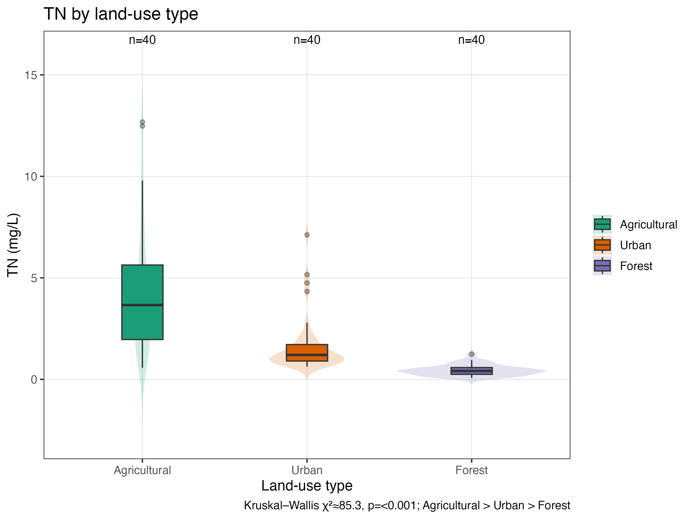
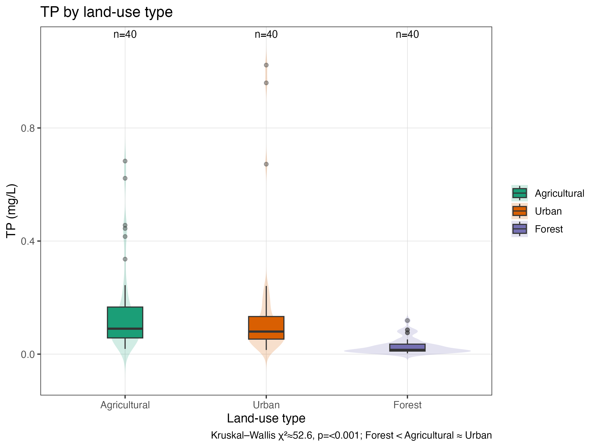
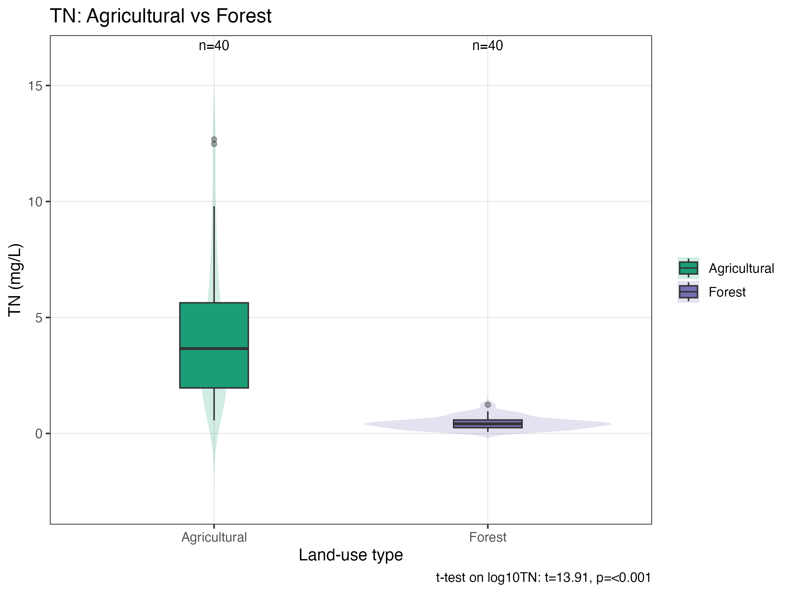
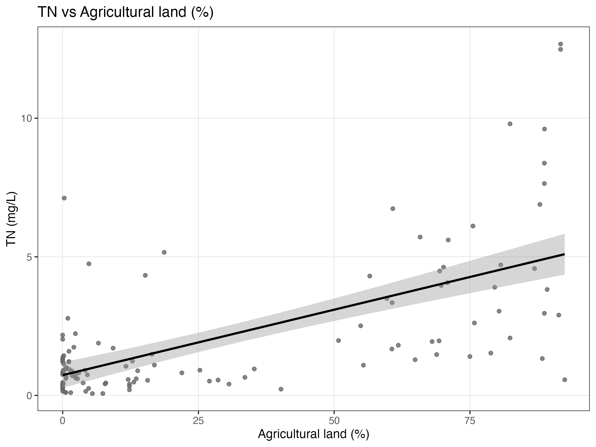
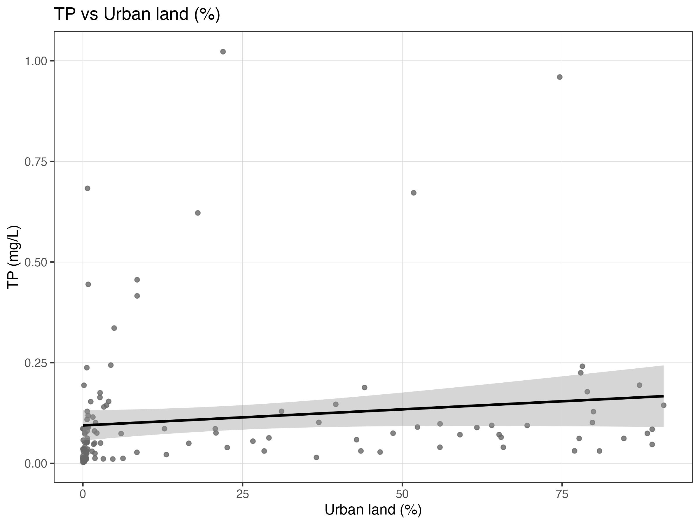
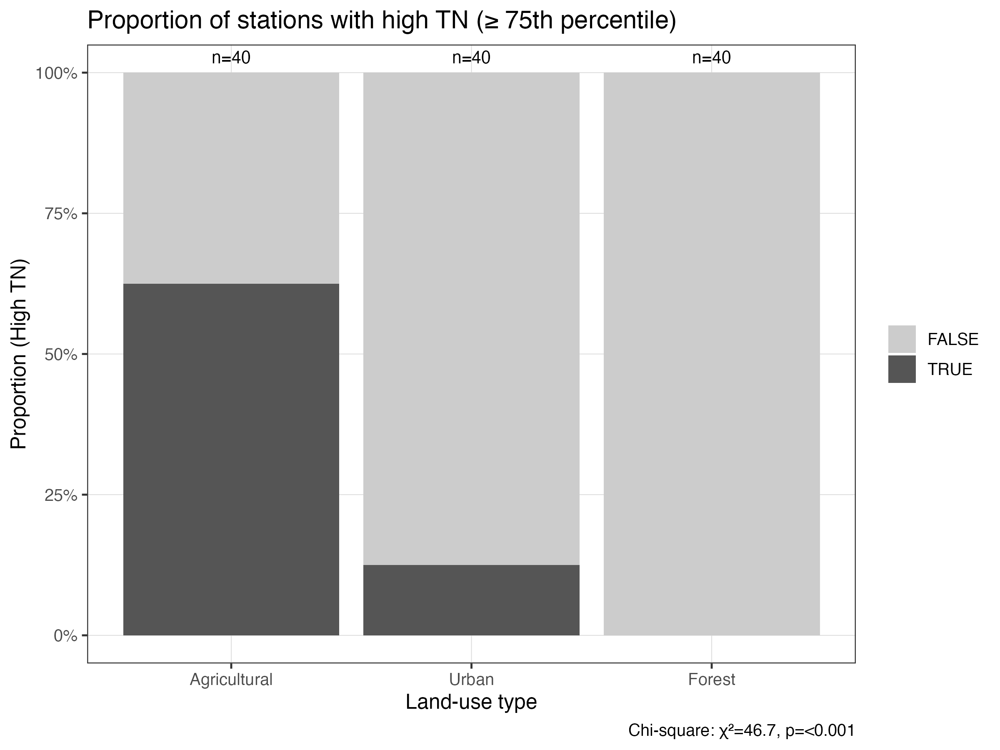

## Introduction

Land-use change can affect downstream river water quality through nutrient inputs and retention processes. Agricultural and urban catchments typically export more nitrogen (TN) and phosphorus (TP) due to fertiliser application and runoff, whereas forested catchments often retain nutrients more effectively. This study uses a small, reproducible subset of NAWQA nutrient data to test whether TN and TP differ among land-use types (Agricultural, Urban, Forest) and to examine how land-use percentages (pAG, pURB) relate to TN and TP.

## Data and Methods

- Dataset: `data/nawqa_landuse_nutrients_subset.csv` with 120 river stations (≈40 per land-use type). Variables include LandUseType, TN, TP, pAG (% agricultural), pURB (% urban), pFOR (% forest), and coordinates.
- Pre-processing: constructed `log10TN` and `log10TP` to improve normality and variance homogeneity; performed Shapiro–Wilk normality tests and Levene’s tests (see `results/tables/assumption_checks.csv`).
- Analysis plan (course-level tests only):
  - TN ~ LandUseType: Kruskal–Wallis (nonparametric) with Dunn-type post hoc, because normality and/or equal variances were violated (especially Urban group).
  - TP ~ LandUseType: Kruskal–Wallis with post hoc comparisons; log10 improved assumptions but Urban still deviated from normality.
  - TN (Agricultural vs Forest): after log10 transform, assumptions acceptable; used independent-samples Student t-test on `log10TN`.
  - pAG vs TN: Pearson and Spearman correlations; simple linear regression TN ~ pAG.
  - pURB vs TP: Pearson and Spearman correlations; simple linear regression TP ~ pURB, emphasising Spearman when Pearson was weak.
  - HighTN/HighTP vs LandUseType: defined HighTN/HighTP as ≥ 75th percentile; used chi-square tests of independence.

## Results


### 3.1 Assumption checks

Shapiro–Wilk tests indicate strong non-normality for TN and TP on the raw scale; `log10TN`/`log10TP` improve normality and Levene’s tests show acceptable variance homogeneity on the log scale, though Urban sometimes still deviates slightly. Below is a compact subset of the assumption table.


Table: Assumption checks: Shapiro–Wilk (by group) and Levene (across groups)

|variable |scale |LandUseType  |          W|   p_value|test         |
|:--------|:-----|:------------|----------:|---------:|:------------|
|TN       |raw   |Agricultural |  0.8754788| 0.0003984|Shapiro-Wilk |
|TN       |raw   |Urban        |  0.6561869| 0.0000000|Shapiro-Wilk |
|TN       |raw   |Forest       |  0.9477294| 0.0633619|Shapiro-Wilk |
|TN       |log10 |Agricultural |  0.9845620| 0.8506962|Shapiro-Wilk |
|TN       |log10 |Urban        |  0.8893966| 0.0009531|Shapiro-Wilk |
|TN       |log10 |Forest       |  0.9458282| 0.0545410|Shapiro-Wilk |
|TP       |raw   |Agricultural |  0.7331638| 0.0000004|Shapiro-Wilk |
|TP       |raw   |Urban        |  0.5142637| 0.0000000|Shapiro-Wilk |
|TP       |raw   |Forest       |  0.7994328| 0.0000066|Shapiro-Wilk |
|TP       |log10 |Agricultural |  0.9735306| 0.4620802|Shapiro-Wilk |
|TP       |log10 |Urban        |  0.9335114| 0.0210025|Shapiro-Wilk |
|TP       |log10 |Forest       |  0.9727991| 0.4393707|Shapiro-Wilk |
|TN       |raw   |NA           | 21.8531827| 0.0000000|Levene       |
|TN       |log10 |NA           |  1.4053483| 0.2493910|Levene       |
|TP       |raw   |NA           |  3.9319832| 0.0222485|Levene       |
|TP       |log10 |NA           |  0.6297396| 0.5345264|Levene       |

### 3.2 Differences in TN among land-use types (Kruskal–Wallis)

The Kruskal–Wallis test shows TN differs among Agricultural, Urban, and Forest sites; post hoc comparisons indicate Agricultural > Urban > Forest.


Table: Main test for TN across LandUseType (Kruskal–Wallis)

|test           |response |transform | df1|df2 | statistic| p_value|
|:--------------|:--------|:---------|---:|:---|---------:|-------:|
|Kruskal-Wallis |TN       |raw       |   2|NA  |  85.25553|       0|


Table: Post hoc pairwise comparisons for TN (BH-adjusted)

|contrast            | p_adj|
|:-------------------|-----:|
|Urban-Agricultural  | 1e-07|
|Forest-Agricultural | 0e+00|
|Forest-Urban        | 0e+00|

<div class="figure">

<p class="caption">Figure 1. Distribution of TN concentrations by land-use type.</p>
</div>

### 3.3 Differences in TP among land-use types (Kruskal–Wallis)

The Kruskal–Wallis test shows TP differs among land-use types. Forest has much lower TP than Agricultural and Urban, while Agricultural vs Urban is not significant.


Table: Main test for TP across LandUseType (Kruskal–Wallis)

|test           |response |transform | df1|df2 | statistic| p_value|
|:--------------|:--------|:---------|---:|:---|---------:|-------:|
|Kruskal-Wallis |TP       |raw       |   2|NA  |  52.63087|       0|


Table: Post hoc pairwise comparisons for TP (BH-adjusted)

|contrast            |     p_adj|
|:-------------------|---------:|
|Urban-Agricultural  | 0.2811557|
|Forest-Agricultural | 0.0000000|
|Forest-Urban        | 0.0000000|

<div class="figure">

<p class="caption">Figure 2. Distribution of TP concentrations by land-use type.</p>
</div>

### 3.4 TN: Agricultural vs Forest (t-test on log10TN)

After log10 transform, assumptions were acceptable; we used an independent-samples Student t-test on `log10TN`.


Table: Two-sample test for TN: Agricultural vs Forest (on log10TN)

|test                         |response |transform | statistic| df| p_value| mean_TN_Agricultural| mean_TN_Forest| sd_TN_Agricultural| sd_TN_Forest|
|:----------------------------|:--------|:---------|---------:|--:|-------:|--------------------:|--------------:|------------------:|------------:|
|t-test (unpaired, equal var) |log10TN  |log10     |  13.91008| 78|       0|             4.277675|      0.4456625|           3.026888|     0.268218|

<div class="figure">

<p class="caption">Figure 3. TN for Agricultural vs Forest.</p>
</div>

### 3.5 Relationship between agricultural land and TN (correlation & regression)

Pearson and Spearman correlations indicate strong positive association between pAG and TN; the simple linear regression explains about 40% of variance.


Table: Correlation and regression summary: pAG vs TN

| Pearson_r| Pearson_p| Spearman_rho| Spearman_p| Slope| Intercept|    R2| F_stat| df1| df2| F_p|
|---------:|---------:|------------:|----------:|-----:|---------:|-----:|------:|---:|---:|---:|
|     0.641|         0|        0.567|          0| 0.047|     0.734| 0.411| 82.285|   1| 118|   0|

<div class="figure">

<p class="caption">Figure 4. TN vs agricultural land (%) with least-squares line and 95% CI.</p>
</div>

### 3.6 Relationship between urban land and TP (correlation & regression)

Pearson correlation is weak/non-significant, whereas Spearman is significantly positive; the linear regression has low R².


Table: Correlation and regression summary: pURB vs TP

| Pearson_r| Pearson_p| Spearman_rho| Spearman_p| Slope| Intercept|   R2| F_stat| df1| df2|   F_p|
|---------:|---------:|------------:|----------:|-----:|---------:|----:|------:|---:|---:|-----:|
|     0.142|     0.122|        0.449|          0| 0.001|     0.094| 0.02|  2.432|   1| 118| 0.122|

<div class="figure">

<p class="caption">Figure 5. TP vs urban land (%) with least-squares line and 95% CI.</p>
</div>

### 3.7 Association between land-use type and high TN/TP (Chi-square)

Chi-square tests indicate that the proportion of high-TN (and high-TP) sites differs by land-use type.


Table: Chi-square test: HighTN and LandUseType

|test                       | statistic| df| p_value|
|:--------------------------|---------:|--:|-------:|
|Pearson's Chi-squared test |  46.66667|  2|       0|


Table: Chi-square test: HighTP and LandUseType

|test                       | statistic| df|   p_value|
|:--------------------------|---------:|--:|---------:|
|Pearson's Chi-squared test |  17.86667|  2| 0.0001319|

<div class="figure">

<p class="caption">Figure 6. Proportion of stations with High TN by land-use type.</p>
</div>

## Discussion

Our course-level analyses consistently show that land-use influences nutrient concentrations. First, Kruskal–Wallis tests indicate strong differences in TN and TP among land-use types: agricultural and urban catchments exhibit higher nutrient levels, whereas forested catchments are lower. Post hoc comparisons confirm Forest < Agricultural and Forest < Urban for both TN and TP; Agricultural vs Urban is clear for TN but not significant for TP.

Second, relationships with land-use percentages align with expectations. TN increases with agricultural land cover: correlations are strong (Pearson and Spearman) and the simple linear regression explains ≈40% of variance. TP vs urban land cover shows a weaker linear association (low R², non-significant Pearson) but a significant monotonic trend (Spearman), consistent with heterogeneous urban runoff patterns.

Third, chi-square tests show that high-nutrient stations (≥ 75th percentile) are more frequent in agricultural and urban catchments than in forested catchments, reinforcing the group comparison results.

Methodologically, we used Kruskal–Wallis in place of ANOVA where assumption checks (Shapiro–Wilk and Levene) indicated violations, and we used a log10 t-test for two-group TN comparisons where assumptions were acceptable post-transform. These choices follow standard introductory flow charts. Limitations include cross-sectional design, potential confounding (e.g., hydrology, point sources), and coarse land-use classes.

## Conclusion (optional)

In this subset of NAWQA nutrient data, land-use type is a strong determinant of TN and TP. Agricultural > Urban > Forest for TN, and Forest is clearly lowest for TP. TN scales positively with agricultural land cover; TP shows a weaker linear but significant monotonic association with urban land cover. These results provide a clear, course-level demonstration of land-use impacts on river nutrients.

<!-- How to render -->

To render this report to HTML from R:

```r
rmarkdown::render("analysis_report.Rmd", output_format = "html_document")
```
